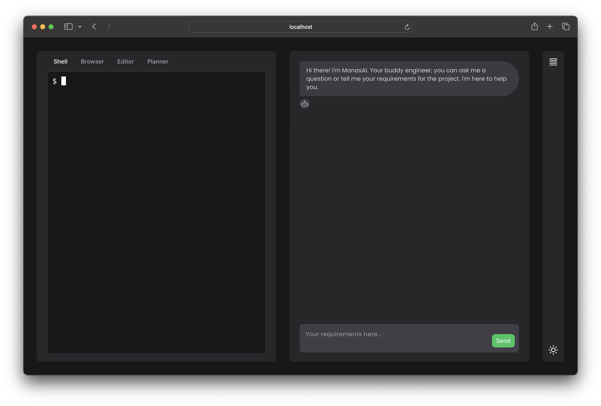

<div align="center">
  
</div>

# ManasAI

[](https://github.com/yashpokar/ManasAI/actions/workflows/verify.yml)

ManasAI, inspired by the groundbreaking [Devin AI](https://www.cognition-labs.com/introducing-devin) by Cognition Labs, is an open-source venture aiming to redefine software engineering through AI. This project harnesses advanced technologies for automating development tasks, enhancing code quality, and streamlining the software lifecycle. Ideal for developers and engineers seeking AI-augmented tools to boost productivity and innovation. Join us in pioneering the next wave of AI in software engineering with ManasAI.

<div align="center">
  
</div>

## Installation

To install ManasAI, clone the repository and run the following command:

```shell
pnpm install
```

Create a `.env` file in the root directory and add the following environment variables:

```shell
cp .env.example .env
```
